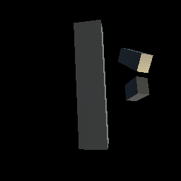
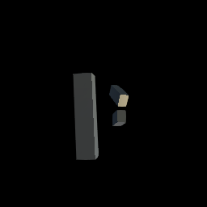
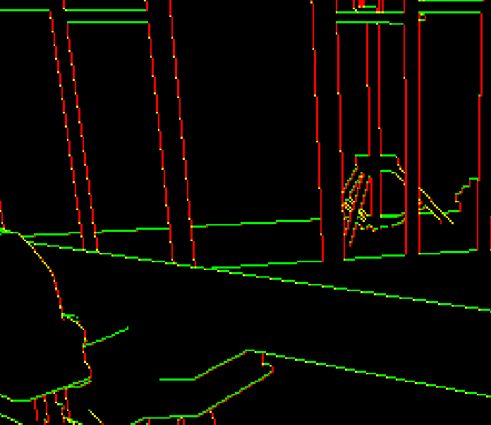
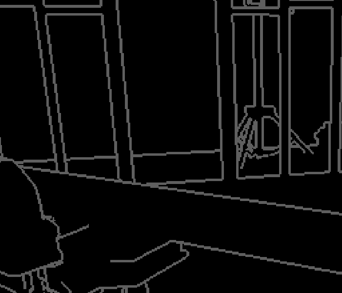
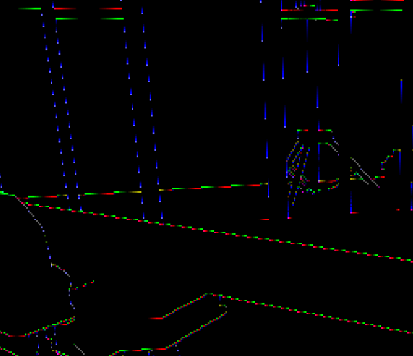
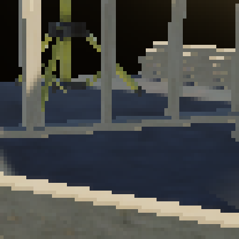
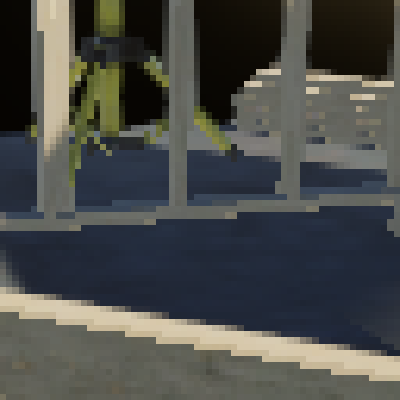
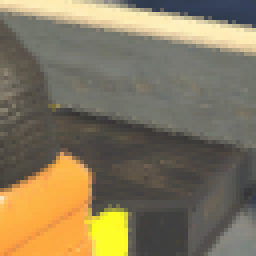

# Unity Morphological Antialiasing

This is an implementation of **Morphological Antialiasing** for **Unity2022.3** and **URP** based on the article "Practical Morphological Antialiasing" from the [GPU Pro 360 Guide to Rendering
](https://www.routledge.com/GPU-Pro-360-Guide-to-Rendering/Engel/p/book/9780815365501) book. The main strength of the technique is its cheap cost compared to obtained results. We will not repeat the contents of the article here, and recommend checking it out.

| No Antialiasing | Our Implementation |
|---|---|
|  |  |

The technique comprises 3 full-screen steps:

* Edge detection.
* Calculation of blending weights.
* Blending with neighborhood.

## Usage

* Add the "Morphological Antialiasing" renderer feature to your renderer asset, at the bottom of the inspector.
* Make sure the camera has a depth buffer.
* Make sure the camera's antialiasing is set to None (as using multiple antialiasing techniques simultaneously hardly makes sense).

### Renderer Feature Settings

* **Render Pass Event**, the event scheduling the pass within frame rendering. Typically you'd use "BeforeRenderingPostProcessing". By that point, no subsequent step should create "jaggies", and post process effects may interfere with edge detection.
* **Intermediate Buffer Type**, lets you select which of the technique's 3 steps you'd like to visualize. For example, looking at the edges buffer may help adjusting threshold.
* **Edge Detect Mode**, the method used for edge detection. We elaborate below.
* **Threshold**, the threshold used for edge detection.
* **Max Distance**, the maximal distance in pixels used for pattern detection.

### Edge Detection Modes

We offer 4 edge detection modes:

* **Depth**, uses the depth buffer.
* **Luminance**, uses the color buffer.
* **Normals**, uses the normals buffer.
* **DepthAndNormals**, uses a combination of normals and depth buffer.

 In our tests, **DepthAndNormals** led to the best results, followed by **Depth**. Generally the depth buffer gives good edges, but may fail to catch all relevant edges. The normals buffer comes as a useful addition. We look at the normalized angle between adjacent normals. Luminance based edge detection tends to struggle to isolate relevant edges wich may lead to artefacts and unnecessary processing of many pixels. Note that the depth and normals buffer are only available in deferred rendering.

Typically, higher maximal distances (up to a plateau) will lead to better results, at the cost of extra GPU computations. It should be tuned according to the nature of the content and performance budget.

## Implementation

The technique is implemented as a `ScriptableRendererFeature` named `MorphologicalAntialiasing`. It uses one pass named `MorphologicalAntialiasingPass`. It uses 3 shaders, one for each of the 3 full-screen steps. Those are very close to the examples provided in the book (except maybe for edge detection and edge search), only adapted for integration with Unity/URP. Shaders are split in a `.shader` and `.hlsl` file. This lets us separate shaderlab properties and classic shader code. It also makes for cleaner code when implementing multiple passes.

The technique uses a lookup texture storing pixel coverages for all handled patterns. We implemented the generation of this texture in `AreaLookup`. It is recalculated whenever **Max Distance** changes. We provide a simple `TestAreaLookup` component to test this lookup generation in isolation.

Below is a view of the intermediate buffers used.

| Edges | Stencil | Blending Weights |
|---|---|---|
|  |  |  |

## Results

| No Antialiasing | Our Implementation |
|---|---|
|  |  |
| URP FXAA | URP SMAA |
|  |  |